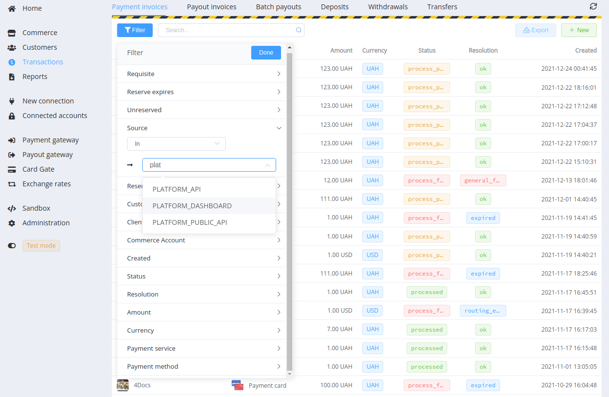
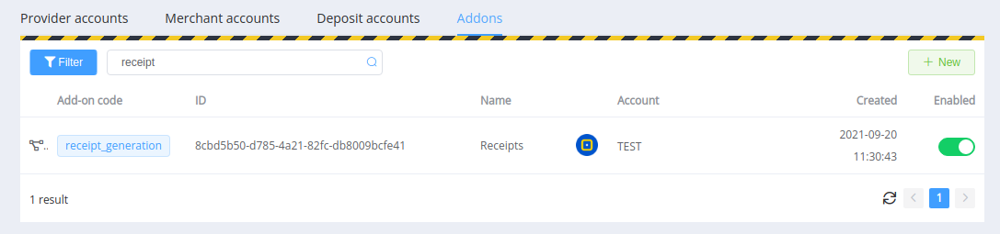
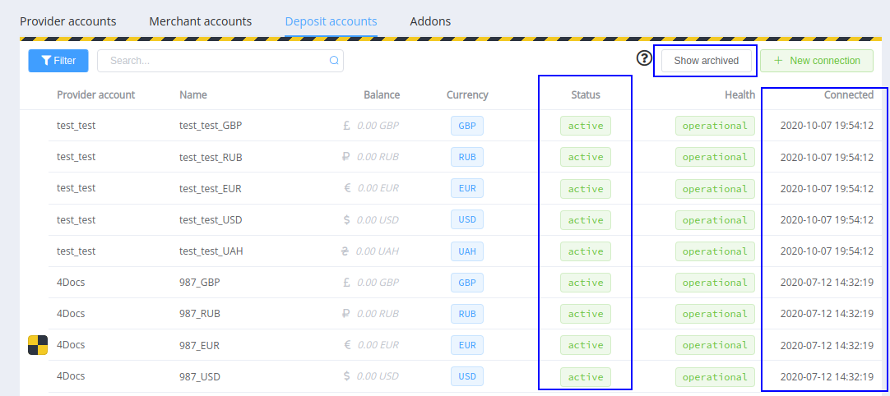
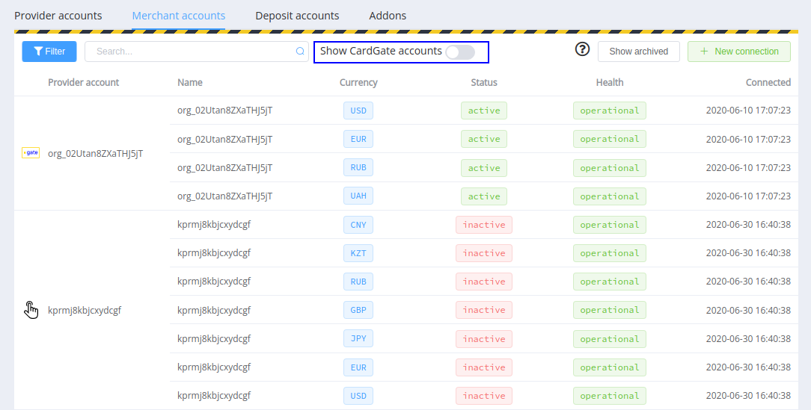
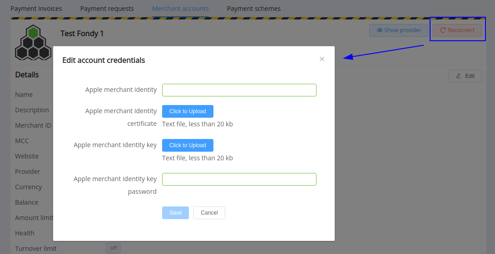
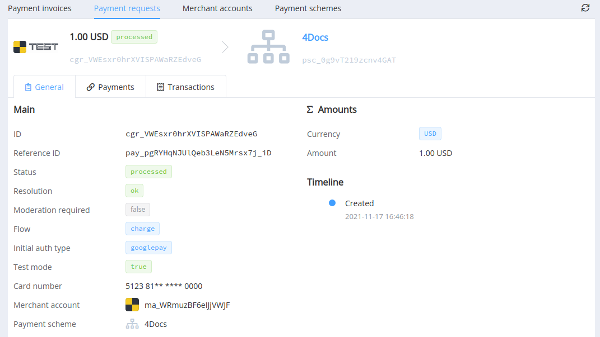
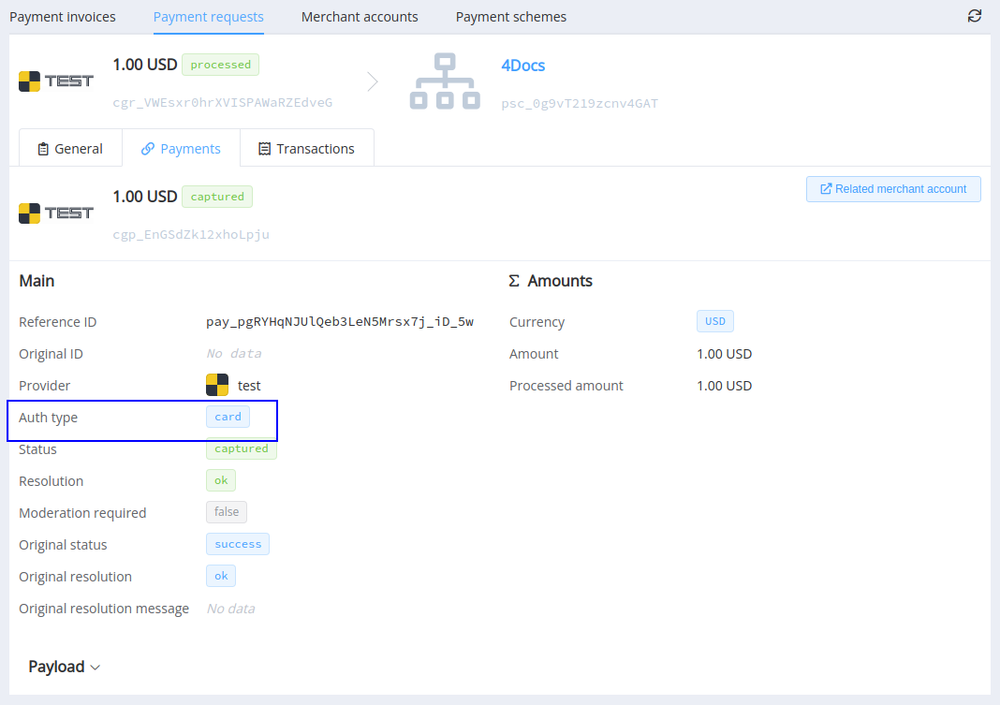

# January 13, 2022

[Corefy](https://corefy.com/) versions: 
**1.140**, **1.139**, **1.138**, **1.137**, **1.136**, **1.135**, **1.134**, **1.133**, **1.132**, **1.131**, & **1.130** 

by Dmytro Dziubenko, Chief Technology Officer

Season's Greetings! And best wishes for 2022 from the [Corefy](https://corefy.com/) team!

We continue growing our products. One of the leading news from the previous month is that the number of supported integrations with third-party payment providers and acquirers exceeded **150**! Please look at the [*Connectors* list](/connectors/); we hope you'll find the best solutions for your needs.

And let's check out other platform enhancements delivered in the latest releases!

## Highlights

* [Dashboard UX updates](#dashboard-ux-updates): added search for addons, new filters in different sections, and updated connected accounts display
* [Card gateway updates](#card-gateway-updates): added the possibility to reconnect merchant accounts, new attributes for payment schemes, extra request parameters in the overview, additional reconciliation for refunds, Google Pay integration
* [Merchant portal setup restrictions](#merchant-portal-setup-restrictions)
* And overall [performance improvements](#performance-improvements)

## List of changes

### Dashboard UX updates

#### Search for the filters' parameters

If you struggle to find proper parameters and entities to filter data on the Dashboard, this update is just right for you. We've added the search feature for dashboard filter fields, so you don't have to scroll the whole list—type a part of the value and select ones from the dropdown.

!!! example ""

    

#### Search and filters for addons

Another UX update we've prepared is for the *Addons* section: now, you can search addons by their names and filter them by the commerce accounts connected.

!!! example ""

    
    

#### Betterments for the Provider hub section

We've made a bunch of updates in displaying the provider hub *Connected accounts* sections:

* Added filters by statuses and by resolutions
* Added the *Show archived* toggle (and filtered archived accounts by default)
* Added the *Status* column to grids
* Displayed connection dates in the deposit accounts' list.

!!! example ""

    

And besides other things, we've hidden merchant accounts that have their counterparts in Card Gateway. No worries: we've also added the *Show CardGate accounts* toggle for helping you to quickly find them (still, it's more convenient to work with them from the related *Card Gateway* tab).

!!! example ""

    

### Card gateway updates

#### Reconnect for Card gateway merchant accounts

We've added the possibility to update merchant accounts with new credentials. Go to the *Card Gate* --> *Merchant accounts* section, select the correct entity and click the *Reconnect* button.

!!! example ""

    

#### New attributes for payment schemes

We've expanded the [list of attributes for routing](/products/payment-gateway/payment-routing-schemes//#card-payment-condition-context-attributes) and [modifiers](/products/payment-gateway/payment-routing-schemes/#modifier-condition-context-attributes) schemes and added:

* `Card month turnover`
* `Card week turnover`
* `Customer successful payments`
* `Customer failed payments`
* `Customer all payments`
* `Google Pay 3DS cryptogram exist`

Read more about optimising card payments with routing in the [related article](/products/payment-gateway/payment-routing-schemes/#card-gateways-routing-schemes).

#### New request parameters in the overview

You might have noticed that we added *Auth type* parameters into payment requests and payments overview. Both determine which flow the transaction was managed by; the only difference is that the *Initial auth type* is obtained from the HPP (or direct link) and displays the start steps of payment request processing. Meanwhile, the *Auth type* specifically shows how payment's transferred to the provider.

!!! example ""

    === "`initial_auth_type` in the payment request overview"

        

    === "`auth_type` in the payment overview"

        

#### Extra reconciliation step for refunds

We found a case when data come asynchronously, and a payment request hangs on the `refund_pending` status in processing refunds. Thus, we've added this status to the list for mandatory reconciliation.

#### Google Pay integration updates

We started 2021 with implementing [Google payments](/integration/payment-methods/google-pay/), and after that, we've done a lot of enhancements to make the Corefy Card gateway fully supports it. So, accept Google pay API Terms of service, obtain your unique merchant identifier, and start to use direct Google pay integration through the `paycoreio` gateway.

### Merchant portal setup restrictions

From now on, the *Merchant Portal* is an entirely separate feature, both from a business and technical standpoint. Configuration and start options are available only when activated for your organisation account.

Don't hesitate to contact your account manager for further information and clarification.

### Performance improvements

We tuned up the engine and made some optimisation under the hood, so everything's become better than before.

Stay with us: we've so much planned ahead!
