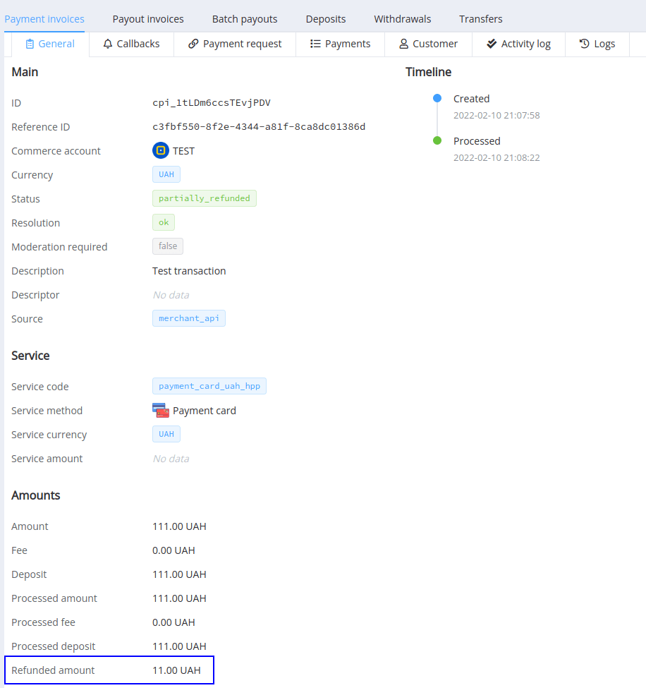
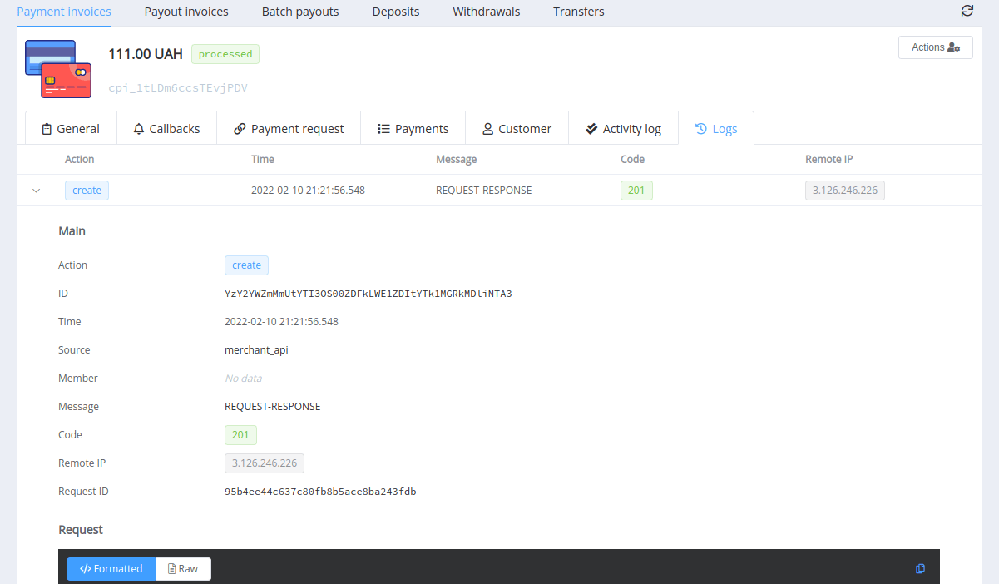
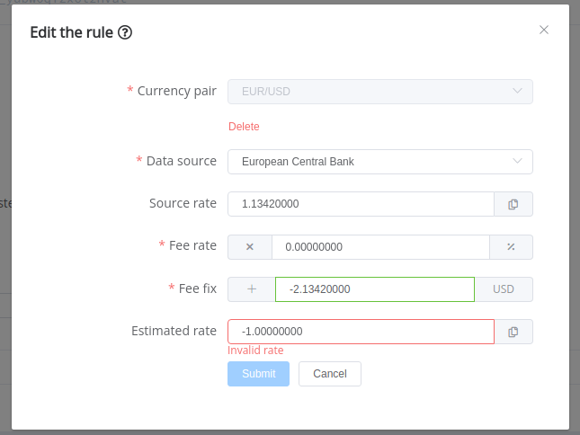
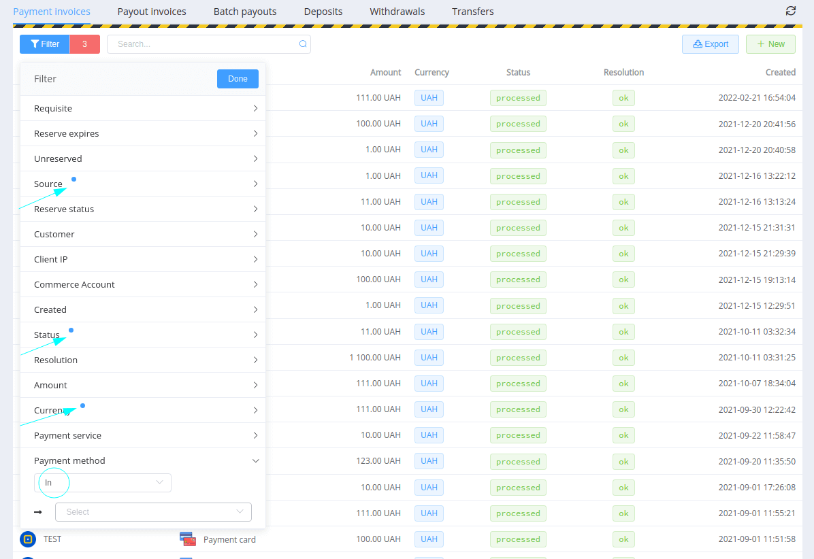

# February 17, 2022

[Corefy](https://corefy.com/) versions: 
**1.150**, **1.149**, **1.148**, **1.147**, **1.146**, **1.145**, **1.144**, **1.143**, **1.142**, & **1.141** 

by Dmytro Dziubenko, Chief Technology Officer

Cheery Greetings from the [Corefy](https://corefy.com/) team!

## Highlights

* [Commerce updates](#commerce-updates): added refunded and charged back amounts to the Payment invoice overview, expanded transaction logs
* [Cardgate updates](#cardgate-updates): deprecated the Optimal routing strategy, updated customer data format in connectors according to providers' requirements
* [Exchange rates schemes updates](#exchange-rates-schemes-updates): extra validation for the fee setup
* [Dashboard improvements](#dashboard-improvements): updated filters' functions
* [Receipt addon](#addons): added the timezone parameter
* [Bug fixes](#bug-fixes) and overall platform improvements

## List of changes

### Commerce updates

#### Added refunded and charged back amounts to the Payment invoice overview

From now on, there are extra *Amounts* parameters displayed only for refunded and charged back transactions. As their names imply, parameters inform about the partially or wholly returned amount.

You can find them in the *Payment invoice* overview in the Corefy Dashboard and the *Payment* overview in the Merchant Portal.

#### Expanded transaction logs

We've extended the information value of transaction logs and added an `action` attribute that notifies about the called API endpoint and a `source` attribute based on a source of the API request.

### Cardgate updates

#### Deprecated the *Optimal* routing strategy

As we announced in the [previous release notes](/release-notes/v1.130-1.140/), as a part of the refactoring process, we've deprecated the *Optimal* strategy in all existing payout schemes and card payment schemes and replaced it with the *Random*.

We also need to mention that adding the *Blank* strategy to routing deletes all other strategies in the group, so use it for a complete stop of processing if related branch conditions are met.

#### Updated customer data format in connectors according to providers' requirements

It's a follow-up to the [previous customer entries' update](/release-notes/archive/2021/v1.122-1.129/#customer-entries-update). Since the data format and naming expected by various PSP may differ, we've gradually updated existing connections to synchronise formats of transferred customer data attributes with providers' expectations.

### Exchange rates schemes updates

#### Additional validation for the fee setup

[Corefy](https://corefy.com/) has various connected exchange rate sources automatically updated and used in transaction processing if the recipient's currency and the sender's currency don't match. You can view the complete list in the appropriate [dashboard section](https://dashboard.paycore.io/fx-rates/resources).

But there are possible cases when we obtain from the resource a value that with fee subtraction may result in a zero or negative one. So, we've added extra validation to rate schemes rules set up to prevent such an occurrence.

And if it does happen during processing due to a rate source glitch and the final estimated rate becomes equal to or less than zero, we'll fail a transaction with the **`amount_conversion_error`** resolution.

### Dashboard improvements

#### Filters' updates

Small but pleasant additions to the filters' functions:

* from now on, there is a badge near the used filter's name,
* and the `In` operator is the default when you set the filter's parameters up.

#### Removed the *+New* button from the *Payment gateway* section

We did some refactoring and found that no one needs it there. An if you want to create a payment using the *Dashboard*, it's better do it with [payment invoice creation](https://dashboard.paycore.io/transactions/payment-invoices/create) in the *Transaction* section.

### Addons

#### Added the timezone parameter for the *Receipt* addon

We've added the timezone parameter to *Receipt* addon configurations to make generated receipts info convenient for users. The default value is UTC+0, but you can reset it to your timezone to date and time of processed transactions shown in the required local time.

!!! tip ""

    Don't hesitate to contact your account manager to configure the timezone parameter and add or update it for your receipts design.

### Bug fixes

We've been working hard to improve our platform and, among other things, found and fixed some irritating bugs.

Stay tuned for the following updates and grow with us!
