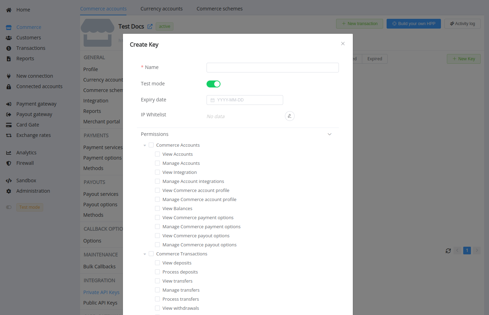
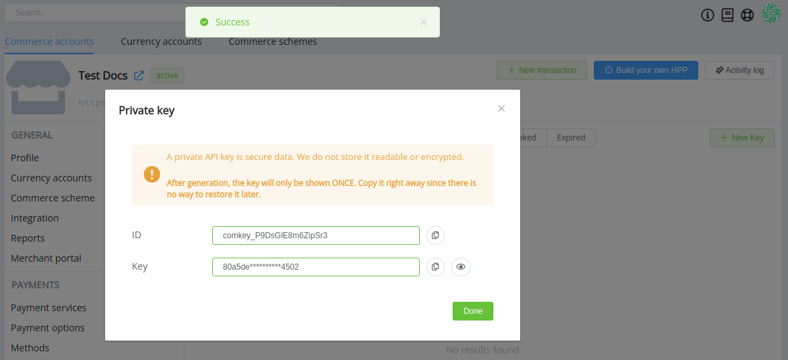
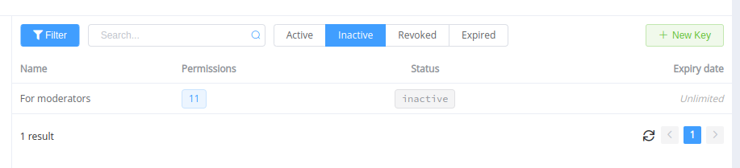
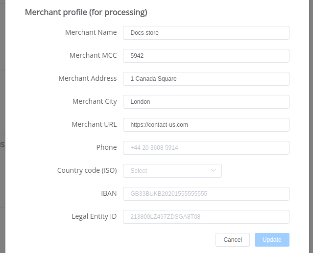
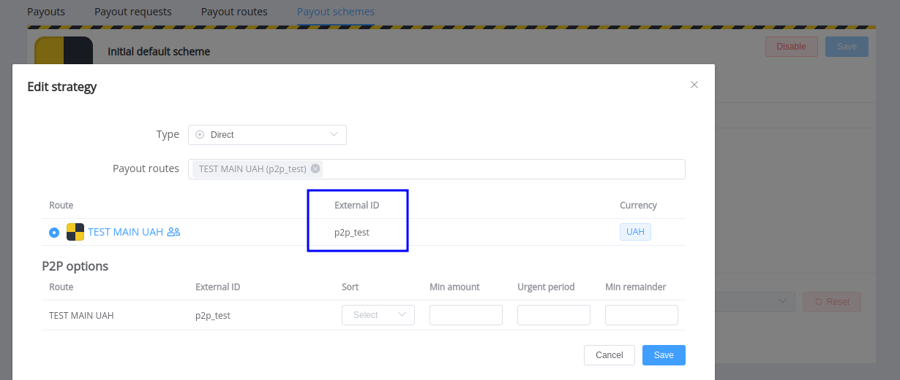
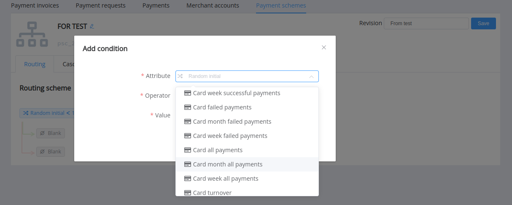
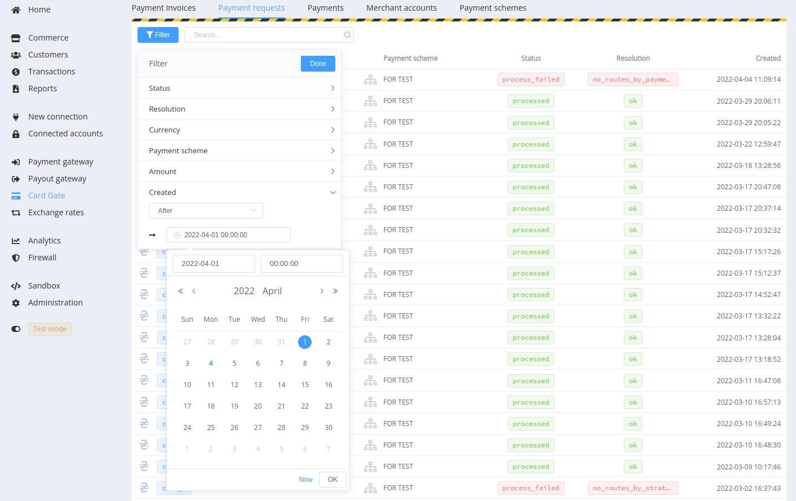
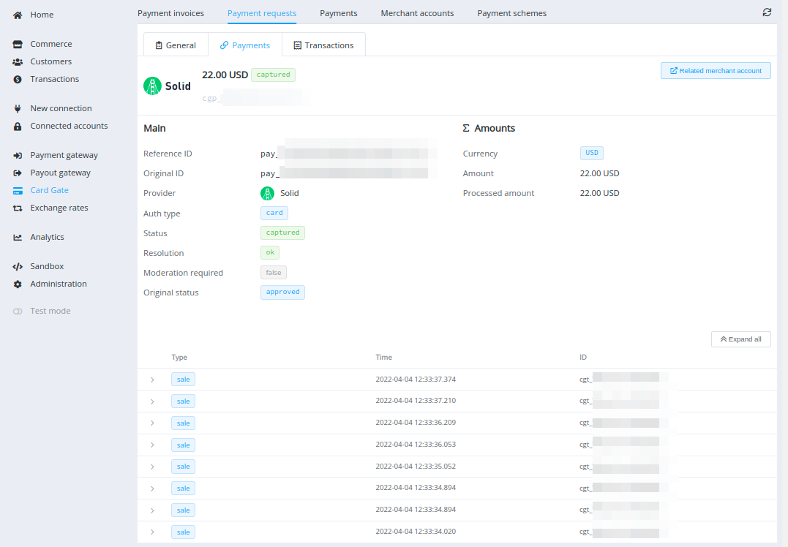
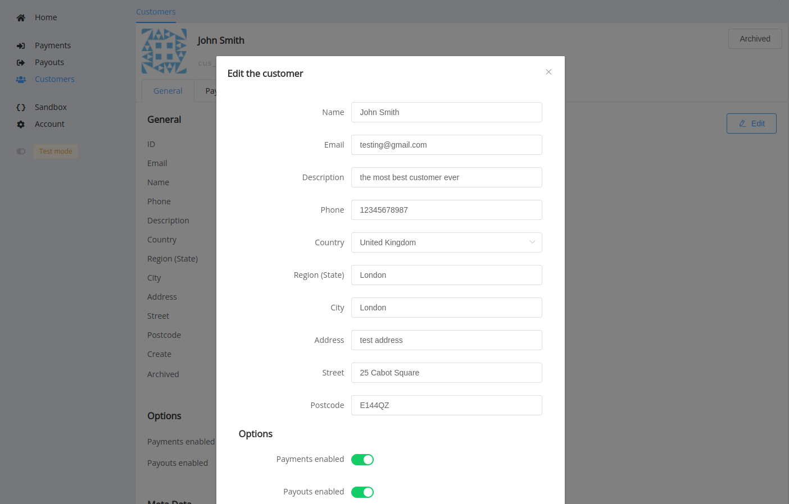
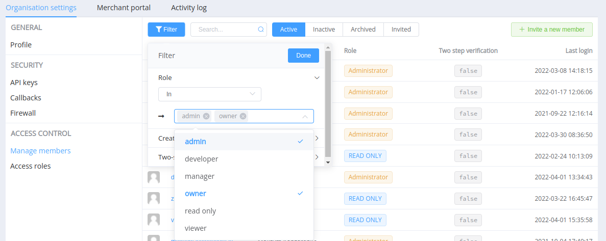

# March 24, 2022

<span style="font-size: 115%">[Corefy](https://corefy.com/) versions:<br>
**1.160**, **1.159**, **1.158**, **1.157**, **1.156**, **1.155**, **1.154**, **1.153**, **1.152**, & **1.151** </span>
<hr>
<div style="text-align: right; font-size: 85%; font-style: italic;">by Dmytro Dziubenko, Chief Technology Officer</div>

Cheery Greetings from the [Corefy](https://corefy.com/) team!

Our dev team continues working on system polishing and enhancement. And over the past weeks, we have accumulated several updates and important information for your attention.

## Announcements

!!! attention "Please be aware: from **April 1, 2022**"

    To optimise data storage, we're limiting retention of transaction statements to **30 days**.

!!! attention "Please be aware: from **May 5, 2022**"

    We're preparing to update the Batch payouts file format for data import and processing. We're replacing a semicolon `;` as the separator for properties (service fields, metadata) in objects with a vertical bar `|`. The column separator will be dynamically defined by the first row (headers) so that you will be able to use either commas `,` or semicolons `;` (but not both types simultaneously).

    You can download file examples at:
    
    - [Batch payouts' file used a comma as a separator](batch_example_comma.csv)
    - [Batch payouts' file used a semicolon as a separator](batch_example_semicolon.csv)

??? example "Batch payouts' CSV spreadsheet used a comma as a separator"

    ``` csv
        service,service_amount,fields_data,reference_id,description,customer,customer_metadata
        test_usd,100,account:587965,BI-01,"Shielded description when separating symbol (,) exists",reference_id:customer-123|email:test@email.com|phone:+380987654321|name:John,key1:value #1|key2:value #2
        card,100,card_number:5123817234060000,BI-02,,reference_id:customer-123|email:test@email.com
        payment_card_usd,100,card_number:5123817234060000
    ```

??? example "Batch payouts' CSV spreadsheet used a semicolon as a separator"

    ``` csv
        service;service_amount;fields_data;reference_id;description;customer;customer_metadata
        test_usd;100;account:587965;BI-01;"Shielded description when separating symbol (;) exists";reference_id:customer-123|email:test@email.com|phone:+380987654321|name:John;key1:value #1|key2:value #2
        card;100;card_number:5123817234060000;BI-02;;reference_id:customer-123|email:test@email.com
        payment_card_usd;100;card_number:5123817234060000
    ```

!!! attention "Also: from **May 5, 2022**"

    We're optimising the Reports, notably changing the column names and their sequence in the row. It may be further modified later if new columns are added. Therefore, to successfully recognise CSV files, you should parse them by the names of columns in the first row (headers).  

    Please check changes in names and sequences below.

??? example "Changes and differences in updated reports' column headers"

    ##### Trial Balance report

    | RU, current sequence              | EN, current sequence               | EN, new sequence                   |
    | ---------------------------------- | ---------------------------------- | ---------------------------------- |
    | День                               | Date                               | Date                               |
    | Balance на начало периода          | Total Balance (Start of period)    | Currency                           |
    | Active balance на начало периода   | Active Balance (Start of period)   | Total Balance (Start of period)    |
    | Reserved balance на начало периода | Reserved balance (Start of period) | Active Balance (Start of period)   |
    | Поступление (SALE)                 | Net Incoming Volume                | Reserved Balance (Start of period) |
    | Комиссия (SALE)                    | Incoming Fees                      | Net Incoming Volume                |
    | Вывод (PAYOUT)                     | Net Outgoing Volume                | Incoming Fees                      |
    | Комиссия (PAYOUT)                  | Outgoing Fees                      | Payment Invoices                   |
    | Зарезервировано за период          | Reserved                           | Payment Invoices Fees              |
    | Разрезервировано за период         | Unreserved                         | Deposits                           |
    | Balance на конец периода           | Total Balance (End of period)      | Transfers (incoming)               |
    | Active balance на конец периода    | Active Balance (End of period)     | Net Outgoing Volume                |
    | Reserved balance на конец периода  | Reserved Balance (End of period)   | Outgoing Fees                      |
    | Валюта                             | Currency                           | Payout Invoices                    |
    | Платежи                            | Payment Invoices                   | Payout Invoices Fees               |
    | Комиссия платежей                  | Payment Invoices fees              | Withdrawals                        |
    | Пополнения                         | Deposits                           | Transfers (outgoing)               |
    | Переводы (входящие)                | Transfers (incoming)               | Reserved                           |
    | Выплаты                            | Payout Invoices                    | Unreserved                         |
    | Комиссия выплат                    | Payout Invoices fees               | Total Balance (End of period)      |
    | Списания                           | Withdrawals                        | Active Balance (End of period)     |
    | Переводы (исходящие)               | Transfers (outgoing)               | Reserved Balance (End of period)   |

    ##### Transactions report

    | RU,  Current sequence | EN, current sequence | EN, new sequence  |
    | --------------------- | -------------------- | ----------------- |
    | processed             | Date                 | Date              |
    | type                  | Type                 | Type              |
    | status                | Status               | Transaction ID    |
    | reference_id          | Reference ID         | Reference ID      |
    | operation_id          | Transaction ID       | Serial number     |
    | serial_number         | Serial number        | Status            |
    | fee                   | Fee                  | Currency          |
    | amount                | Amount               | Amount            |
    | reserve_amount        | Reserve Amount       | Fee               |
    | balance               | Balance              | Reserve Amount    |
    | reserved_balance      | Reserved Balance     | Balance           |
    | currency              | Currency             | Reserved Balance  |
    | description           | Description          | Description       |
    | service_code          | Service Code         | Service Code      |
    | customer              | Customer Data        | Customer Data     |
    | customer_metadata     | Customer Metadata    | Customer Metadata |

    ##### Organization Trial balance report

    Please note that columns with **bolded names** in the 'New sequence' will be added to reports after the update.

    | RU, Current sequence               | EN, Current sequence               | EN, New sequence                   |
    | ---------------------------------- | ---------------------------------- | ---------------------------------- |
    | Balance на начало периода          | Active Balance (Start of period)   | **Date**                           |
    | Active balance на начало периода   | Active Balance (Start of period)   | Commerce Account ID                |
    | Reserved balance на начало периода | Reserved balance (Start of period) | Commerce Account Name              |
    | Поступление (SALE)                 | Net Incoming volume                | Currency                           |
    | Комиссия (SALE)                    | Incoming fees                      | Total Balance (Start of period)    |
    | Вывод (PAYOUT)                     | Net Outgoing volume                | Active Balance (Start of period)   |
    | Комиссия (PAYOUT)                  | Outgoing fees                      | Reserved balance (Start of period) |
    | Balance на конец периода           | Total Balance (End of period)      | Net Incoming volume                |
    | Active balance на конец периода    | Active Balance (End of period)     | Incoming fees                      |
    | Reserved balance на конец периода  | Reserved balance (End of period)   | **Payment Invoices**               |
    | Зарезервировано за период          | Reserved                           | **Payment Invoices fees**          |
    | Разрезервировано за период         | Unreserved                         | **Deposits**                       |
    | Валюта                             | Currency                           | **Transfers (incoming)**           |
    | Commerce ID                        | Commerce Account ID                | Net Outgoing volume                |
    | Commerce name                      | Commerce Account Name              | Outgoing fees                      |
    |                                    |                                    | **Payout Invoices**                |
    |                                    |                                    | **Payout Invoices fees**           |
    |                                    |                                    | **Withdrawals**                    |
    |                                    |                                    | **Transfers (outgoing)**           |
    |                                    |                                    | Reserved                           |
    |                                    |                                    | Unreserved                         |
    |                                    |                                    | Total Balance (End of period)      |
    |                                    |                                    | Active Balance (End of period)     |
    |                                    |                                    | Reserved balance (End of period)   |

## Highlights

* [Commerce update](#commerce-update): added API Keys generation and overview, displaying parameter for payout routing, extended Merchant profile data
* [Card Gateway update](#card-gateway-update): added metrics for Payment routing, filtration by date of creation in the lists, logs for payments
* [Customers' details extended in the Merchant application](#customers-details-extended-in-the-merchant-application)
* [Updated Organisation settings: access control](#organisation-settings-access-control)
* [Other notable improvements](#other-performance-improvements)

## In the details

### Commerce update

#### API Keys generation section and overview

We've have improved an approach to working with API keys to help you manage security and access issues. Now you can create different keys and provide access to integration functions at your own discretion.

To create new keys, go to *Commerce* --> *Account settings* --> *Integration*. There are two separate sections: for Private and for Public APIs.

!!! example ""

    

Creating new ones, pay attention on Test mode enabling or disabling and setting of the key's lifetime because you won't be able to edit it later. Also, be prepared that you have only one possibility (right after creation) to copy the created Private API key and save it on your devices.

!!! example ""

    

Then, through the lists of all keys, you can manage keys, activate, or revoke them and change access to API endpoints.

!!! note "Please note"

    For now, the maximum number of active keys for a commerce is 5.

!!! example ""

    

Both previous (set in *Commerce* --> *Account settings* --> *General: Integration*) and new keys can be used until we're sure all our clients get acquainted with all the changes.

#### Merchant profile data extended

We've also added new attributes for merchant profiles: IBAN and Legal entity ID. To set up them, go to *Commerce* --> *Profile* and edit *Merchant profile (for processing* parameters.

!!! example ""

    

#### Displaying parameter for payout routing 

A parameter `route_external_ID` is displayed and can be used in payout routing schemes for search.

!!! example ""

    

### Card Gateway update

#### Added metrics for Payment routing

We've added new metrics about transactions to the list of attributes for payment routing and modifiers schemes:

- Card week successful payments
- Card month successful payments
- Card week failed payments 
- Card month failed payments
- Card week all payments
- Card month all payments

!!! example ""

    

Read more about optimising card payments with routing in the [related article](/products/payment-gateway/payment-routing-schemes/#card-gateways-routing-schemes).

#### Added filtration by date of creation

From now on, you can filter by date of creation lists of:

- Payment Invoices
- Payment Requests
- Merchant Accounts
- Payment Schemes

!!! example ""

    

#### Added logs for payments

To improve reconciliation process, we've added displaying logs for payments and transactions with indicated datetime and operation ID.

!!! example ""

    

Click on the log line to expand the detailed message about transaction.

### Customers' details extended in the Merchant application

We've extended the list of attributes that can be transferred for customer records, both for Payments and Payouts invoices. The new attributes are optional and include country, region, city, address, and ZIP code. If transferred, they will be displayed in Payment or Payout invoice overview and also—in the customer data section where you can also add new or edit existing data.

!!! example ""

    

You can check parameters and examples for transferring customer details on the [Checkout reference](https://merchant-docs.paycore.io/en/guides/checkout/reference/#customer-details) page.

### Organisation settings: access control

We've upgraded *Organisation settings* --> *Access control: Manage members* section, added enabled two-factor authentication as a displayed parameter, filters and search for users by name, email and member ID.

!!! examples ""

    

### Other performance improvements

We're also released the major upgrade of the Dashboard activity log and extended a number of events logged. And vice verse, during refactoring process, deleted the output of data that didn't have a functional purpose, such as the Routes column in the Payment routing schemes' list and the *Public ZeroFee* badge option in Commerce settings.

Stay tuned for the next updates!
