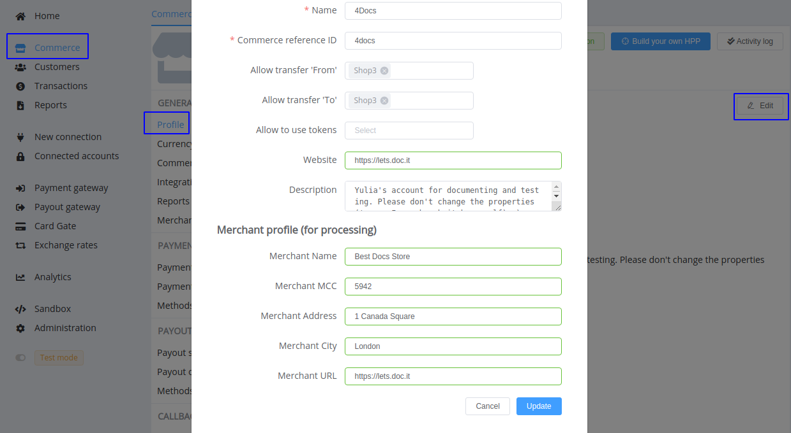
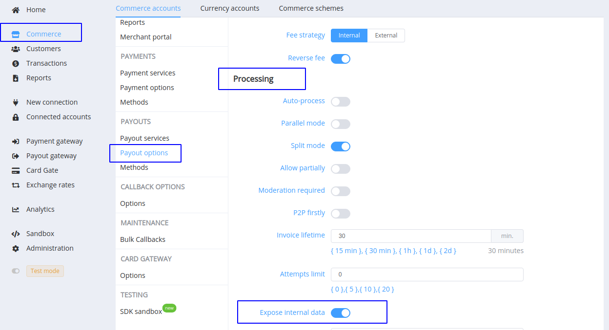
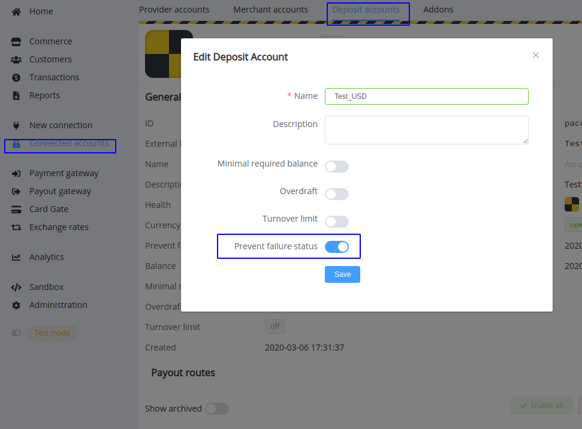

# May 13, 2021

<span style="font-size: 115%">[Corefy](https://corefy.com/) versions:<br>
**1.65**, **1.64**, **1.63**, **1.62**, **1.61**, **1.60**, **1.59**, **1.58**, **1.57**, **1.56**, **1.55**, & **1.54**</span>
<hr>
<div style="text-align: right; font-size: 85%; font-style: italic;">by Dmytro Dziubenko, Chief Technology Officer</div>

Cheery Greetings from the [Corefy](https://corefy.com/) team!

Over the past month, our dev team has prepared a ton of enhancements that we hope you will like.

## Highlights

* [Commerce updates](#commerce-updates): expanded access settings for commerce accounts and operations, added `merchant_profile` object to the Commerce settings and request creation and options to control Saved cards access scope
* [Connectors Hub update](#connectors-hub-update): updated the Callback handler, added `payouts` array to Callback for payouts processing, added the Deposit account option for preventing finalising payout transactions with failure resolutions
* [Card Gateway update](#card-gate-update): added modifier by card status to Payment schemes
* [Reports optimising](#reports-optimising)
* [Receipt Addon update](#addons-update): receipts generating for Payout invoices

## List of changes

### Commerce updates

#### Expanded access settings

We've made the Organisation setup more flexible and divided the default access scope for commerce account and operation management into permissions to view (read) and edit (write). Check and assign roles and permissions at the Dashboard (*Administration* --> *Organisation settings* --> *Access control: Access roles*).

??? info "Updated default access scope includes:"

    | Role permissions                        | Owner and Admins | Managers | Others |
    |-----------------------------------------|:----------------:|:--------:|:------:|
    | View Commerce accounts                  |        ✔️         |    ✔️     |   ✔️    |
    | Edit Commerce accounts                  |        ✔️         |    ✔️     |        |
    | View the Commerce integration section   |        ✔️         |          |        |
    | Update the Commerce integration section |        ✔️         |          |        |
    | View the Commerce account profile       |        ✔️         |    ✔️     |   ✔️    |
    | Edit the Commerce account profile       |        ✔️         |    ✔️     |        |
    | View account balances                   |        ✔️         |    ✔️     |        |
    | View Commerce payment options           |        ✔️         |    ✔️     |        |
    | Manage Commerce payment options         |        ✔️         |          |        |
    | View Commerce payout options            |        ✔️         |    ✔️     |        |
    | Manage Commerce payout options          |        ✔️         |          |        |
    | View the Deposits section               |        ✔️         |    ✔️     |        |
    | Create deposits                         |        ✔️         |          |        |
    | Process deposits                        |        ✔️         |          |        |
    | View the Transfers section              |        ✔️         |    ✔️     |        |
    | Create transfers                        |        ✔️         |          |        |
    | Process transfers                       |        ✔️         |          |        |
    | View the Withdrawals section            |        ✔️         |    ✔️     |        |
    | Create withdrawals                      |        ✔️         |          |        |
    | Process withdrawals                     |        ✔️         |          |        |
    | View Payment sections                   |        ✔️         |    ✔️     |        |
    | Create payment invoices                 |        ✔️         |          |        |
    | View Payment sections                   |        ✔️         |    ✔️     |        |
    | Create payment invoices                 |        ✔️         |          |        |
    | View Payout sections                    |        ✔️         |    ✔️     |        |
    | Create and process payout invoices      |        ✔️         |          |        |

#### Merchant profile for processing

We added the `merchant_profile` object to commerce properties that contains information about the merchant company. The {{custom.company_name}} platform adds the object during payment and payout requests creation, and the data is sent unchanged to payment service providers if they require it for recording and processing.

Get this data through API request, update in the Dashboard Commerce settings (*Commerce accounts* --> *General: Profile*).

!!! example ""

    === "Sample code of Commerce account data attributes"

        ``` json
            "data": {
                "type": "commerce-accounts",
                "id": "coma_Bb1erfDTYzivNSp",
                "attributes": {
                    "merchant_profile": {
                        "company_name": "Best Docs Store",
                        "mcc": "5942",
                        "company_address": "1 Canada Square",
                        "city": "London",
                        "website_url": "https://lets.doc.it"
                    }
                }
            }
        ```
    
    === "Edit in the Dashboard Commerce settings"

        

Similar parameters in the `cardgate_options` object for host-to-host payments will be deprecated. So, if you filled in the Card Gateway options, we will copy them to the merchant_profile with subsequent updates.

#### Share Saved card tokens between Commerce accounts

Another new option is allowing sharing tokens for saved card numbers between accounts. In so doing, accounts for sharing need to have a simple ledger scheme, and you can choose several ones from the drop-down list in the Commerce settings.

Suppose a customer previously used the 'Remember me' checkbox on the  Checkout of the commerce account that has the option enabled. Consequently, they will see their cards when visiting the Checkout pages of accounts to which tokens were shared and save time filling in the payment form.

But notice that if you stop sharing saved tokens between accounts, new cards won't be saved, but choosing old ones will remain available for users.

### Connectors Hub updates

#### Callback handler update

Analysing interaction with various providers, we encountered that part of them doesn't sign notifications with a unique signature. Such messages we couldn't validate and needed additional tools to make sure that the received data is accurate.

So we've updated the callback handler and made the pull statement's request sent as soon as we receive such an 'unsigned' callback message. This allows faster reconciliation and further processing of the transaction.

#### Updated Callbacks for payout invoices

The use of the splitting tool is often helpful during transaction routing. But it also creates complications for analysis and efficiency estimating. To assist in collecting data into which parts the transaction was divided and receiving statuses and resolutions for each of them, we've  added a `payouts` attribute whose value contains an array of objects with separate payouts data for reconciliation responses and Callbacks for finalised payout invoices.

By default, you get information only about the successfully processed parts. And suppose you need to collect more complete data about splitting, including failed to process amounts and provider IDs, code, resolution, payload etc., of each part. In that case, you can turn on the *Expose internal data* option in the payout processing settings.

!!! example ""

    === "Sample of the Callback code with the `payouts` array"

        ```json hl_lines="11 18 26"
            {
                "data":{
                    "id":"cpoi_ztg1119SQjlAk1Y2",
                    "type":"payout-invoices",
                    "attributes":{
                        "fee":0,
                        "amount":1000,
                        "currency":"USD",
                        "fields":[],
                        "status":"processed",
                        "payouts":[
                            {
                                "id":"po_4a3Bgz6YR3cRjW6k", // a unique transaction ID
                                "rrn":null, // Retrieval Reference Number, a value is optional
                                "amount":725,
                                "currency":"USD",
                                "status":"processed" // a final processing status of the part
                            },
                            {
                                "id":"po_3cR4z6kgYR6aj3BW",
                                "rrn":null,
                                "amount":275,
                                "currency":"USD",
                                "status":"processed"
                            }
                        ]
                    }
                }
            }
        ```

    === "If the *Expose internal data* option enabled"

        ```json hl_lines="11 19 22 31 34"
            {
                "data":{
                    "id":"cpoi_ztg1119SQjlAk1Y2",
                    "type":"payout-invoices",
                    "attributes":{
                        "fee":0,
                        "amount":1000,
                        "currency":"USD",
                        "fields":[],
                        "status":"process_failed",
                        "payouts":[
                            {
                                "id":"po_4a3Bgz6YR3cRjW6k", // a unique transaction ID
                                "rrn":null, // Retrieval Reference Number
                                "amount":725,
                                "currency":"USD",
                                "status":"process_failed", // a final processing status of the part
                                "payload": [], // additional info from PSP
                                "provider_id": "po_16qdUPN2sUkrNtLp_external_id", // a transaction ID in the provider database
                                "provider_code": "test", // a transaction provider code
                                "resolution": "invalid_details"  // an original error code
                            },
                            {
                                "id":"po_3cR4z6kgYR6aj3BW",
                                "rrn":null,
                                "amount":275,
                                "status":"process_failed",
                                "payload":[],     
                                "currency":"USD",
                                "resolution": "invalid_details",
                                "provider_id": "po_1krNdUPN2sULpt6q_external_id",
                                "provider_code": "test"
                            }
                        ]
                    }
                }
            }
        ```

    === "Find the *Expose internal data* option in the Commerce payouts settings"

        

#### Deposit accounts improving

*Prevent a failure status* is an extra option for Deposit accounts, preventing finalising payout transactions that obtain failure status (for example, due to data transport errors). If you enable it, such transactions get the pending status and the moderation_required label and wait for manual statement reconciliation and assignment of the actual status.

!!! info ""

    

### Card Gate update

We added the Card status attribute for payments' modifier schemes. It accesses your organisation card vault and assumes values like:

* `new`
* `expired`
* `verified`
* `unverified`
* `verify_failed`

!!! info ""

    

### Reports optimising

We've revised the reports generation process and made it far less resource-intensive and therefore faster. What else to add: it’s just a necessary job.

### Addons update

And good news for *Receipt Addon* users: the Corefy platform starts supporting receipt generation for Payout invoices. The principle of use is the same as for Payment invoices, but you can set another template for this type of transactions.

### Bug fixes

Lastly, we've successfully improved our products' performance and resolved revealed bug issues.

Stay tuned for the next updates!
