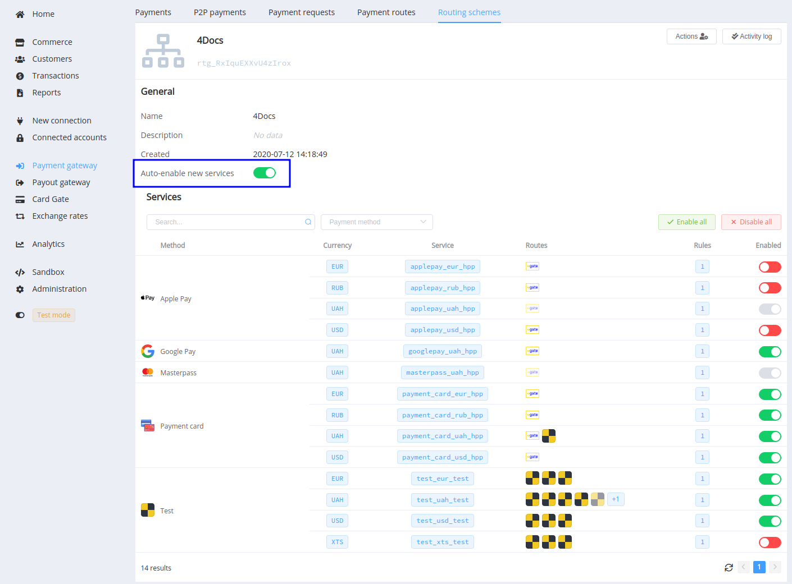
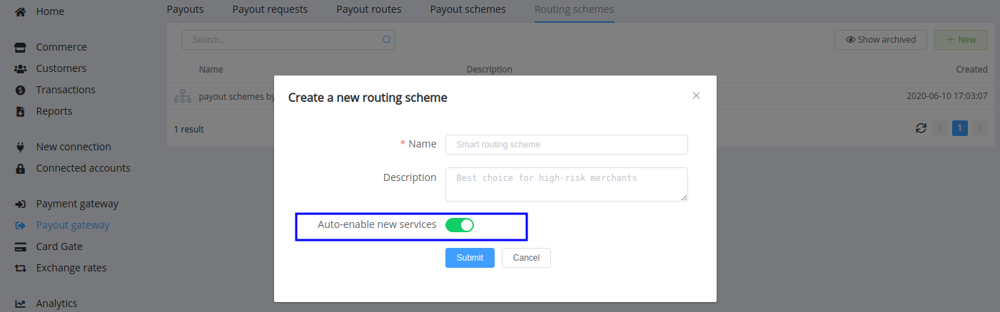
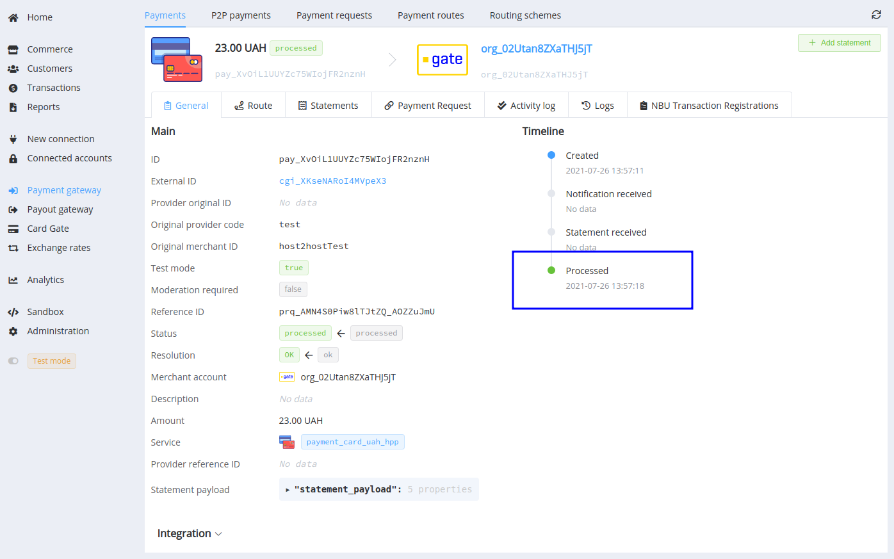
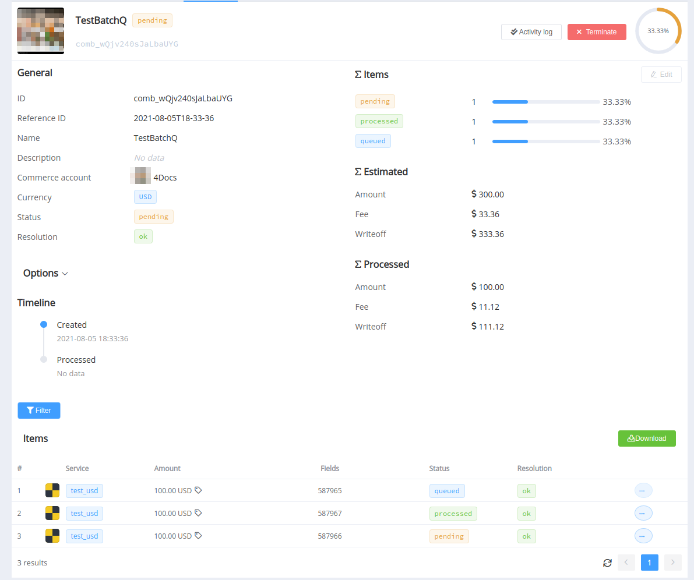
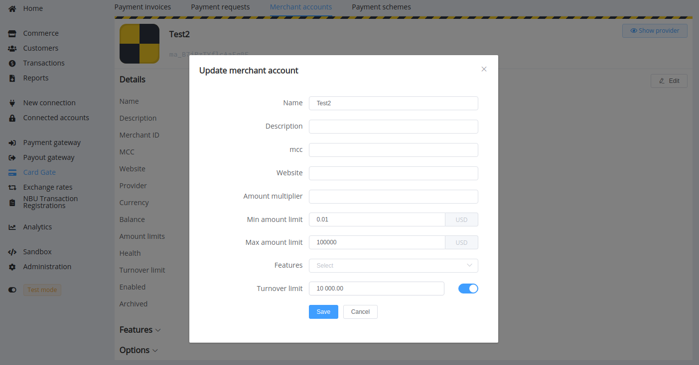
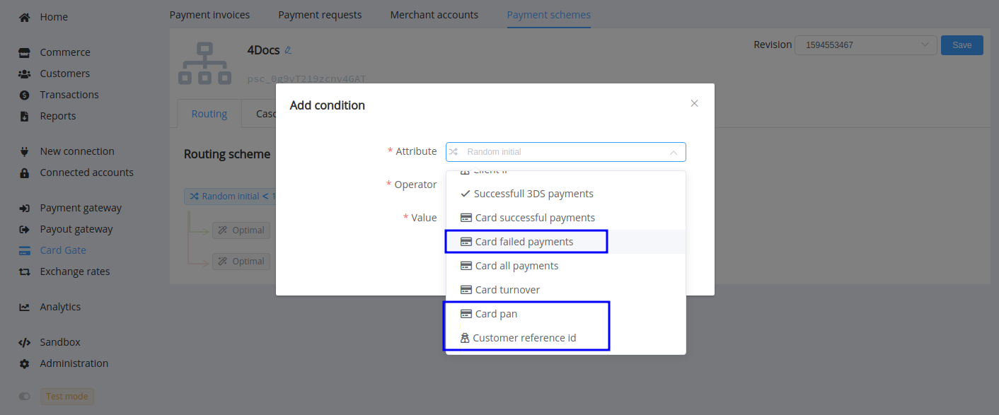
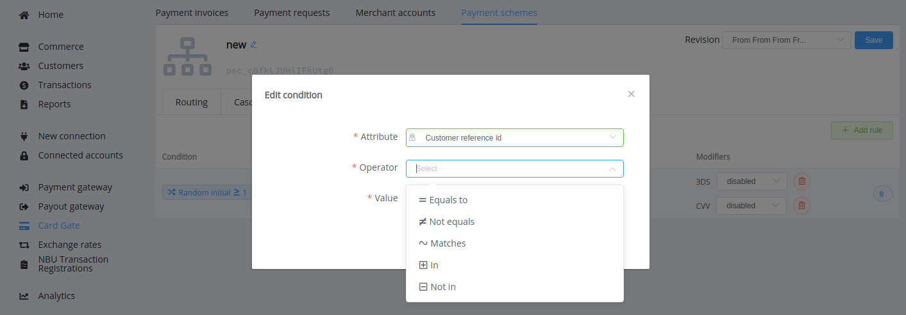
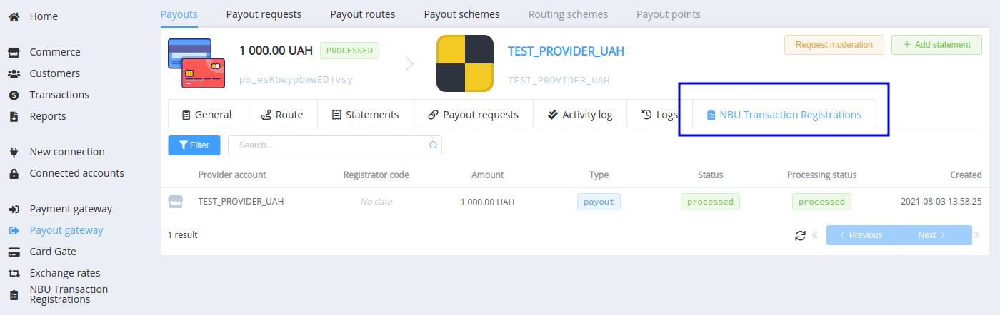
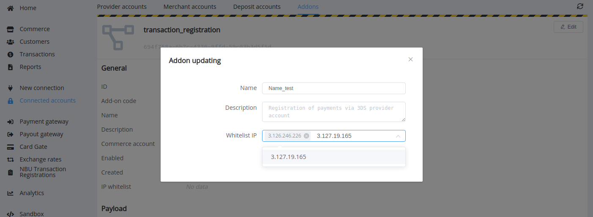

# August 10, 2021

[Corefy](https://corefy.com/) versions: 
**1.93**, **1.92**, **1.91**, **1.90**, **1.89**, **1.88**, **1.87**, **1.86**, **1.85**, **1.84**, & **1.83**

by Dmytro Dziubenko, Chief Technology Officer

Cheery Greetings from the [Corefy](https://corefy.com/) team!

This month we've focused on processing and routing updates and significantly boosted card gateway feasibilities.

!!! warning "Please be aware"

    We introduced the HPP v2.0 for [quite a while](/release-notes/archive/2019/v1.4.2/#hpp-v20), and now we're finally saying "Goodbye!" to using the HPP version 1.0. Therefore, we expect all our clients have already migrated to use a more convenient and optimised HPP version, so we removed the associated settings and dependencies from the [Dashboard](https://dashboard.paycore.io).

## Highlights

* [Routing updates](#routing-updates): added option for service auto-enabling
* [Processing updates](#processing-updates): added `processed` timestamp to payment and payout invoices' overviews, added a `queued` status for items in batch payouts
* [Card Gateway updates](#card-gateway-updates): added the turnover limit for merchant accounts, new routing and modifier scheme attributes, new resolution for cascading, `cash` payment and payout methods for manual transactions, changed handling asynchronous failures process
* [Analytics update](#analytics-update): new queries
* [Addons updates](#addons-updates): added IP filter to restrict API requests to the addon subdomain, NBU registration data tabs for payment and payout entries
* And various [performance improvements](#performance-improvements)

## List of changes

### Routing updates

#### Service auto-enable option

Since each method may have more than one service available for transactions in different currencies, you need to configure them separately. But to simplify enabling new services when connecting them to schemas (or vice versa—prevent their addition before the manager checks), we added a new option: *Auto-enable new services*. If it's turned on and you add a new method or another currency associated with it, the related new service will be automatically allowed.

!!! tip ""

    

Check the option when creating and viewing:

- Commerce schemes
- Payout schemes
- Payout routing schemes
- Payment routing schemes

!!! tip ""

    

### Processing updates

#### Processed timestamp

To help set up transaction entity registers for organisations not using the Ledger, we added the `processed` timestamp to payment and payout invoices data.

!!! tip ""

    

The timestamp displays when the transaction received a final status: `processed`, `partially_processed`, `process_failed`, `expired`, or `terminated`.

#### Queued status for batch payout items

We added a `queued` status for items of batch payouts to prevent situations when ready items queued several times asynchronously. 

!!! tip ""

    

You can find the complete status flow in the [related article](/products/batch-payouts/#check-items-and-process).

### Card Gateway updates

#### Merchant account turnover limit

As an equivalent to the same option in the Deposit account settings, the Merchant account turnover limits daily transaction funds. The system reviews the number of processed funds once per hour and excludes the account from routing until the next date after reaching the limit.

#### New routing and modifier scheme attributes

We've added new attributes for routing and modifier schemes conditions: `Card pan` (primary account number) and `Customer reference id`.

We've also started collecting metrics about failed card payments for the entire period of running the card vault, and you can use them as conditions as well.

!!! tip ""

    
    

#### New resolution for cascading

We added the `card_status_is_restricted_for_provider` resolution to the cascading list. A possible reason for receiving such a resolution is the card status set limitations for payments, possibly due to regional or provider specificities. So now, getting it, the card gateway will try to reroute the transaction to another provider.

#### Handling asynchronous failures

There are two types of transaction failures based on notification delivery:

- synchronous failure when the provider rejects the transaction executing immediately after the request; 
- and asynchronous—that occurs if the system obtains notification about failure later, with callbacks or during reconciliation.

Handling asynchronous failures is more complex because, at the time, the payment page may display a pending status page or already redirect the customer to the related Return URL. We finalise the payment request with the `unable_to_cascad` resolution to prevent the payment cascading or auto-repay. Meanwhile, the repay process is still available for the customer in that case. 

#### Cash payment and payout methods for manual transactions

The Manual connector serves as an auxiliary tool for transactions that merchants cannot handle through other connections. Now it also helps with cash transaction recording.

Connect the manual connector with this method, or if you already connected it, ask your account manager to add the `cash` to the list of methods used.

### Analytics update

We've expanded Analytics abilities with new queries:

- `cardgate_options` for the `com_account` table;
- and `customer_id` for the `com_payout_invoices`.

### Addons updates

Following the [previous update for the NBU transactions registration addon](/release-notes/v1.76-1.82/#addons-management), we added related data tabs for payment and payout entries. It displays all registered transactions related to the invoice.

!!! tip ""

    

We also added the IP filter to restrict API requests to the addon subdomain for the addons with external usage. Go to the Overview page and edit its IP whitelist setting.

!!! tip ""

    

If you're not sure the addons used by your organisation support external usage and, consequently, need the IP whitelist, clarify this option with your account manager.

### Performance improvements

We also made various bug fixes, and it was small but important changes for general performance improvements.

Stay tuned for the next updates!
