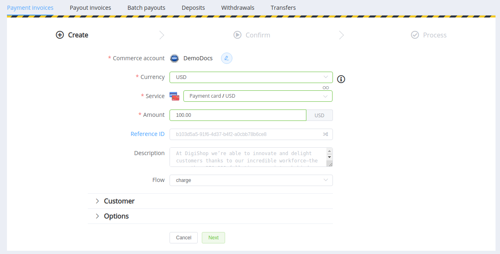
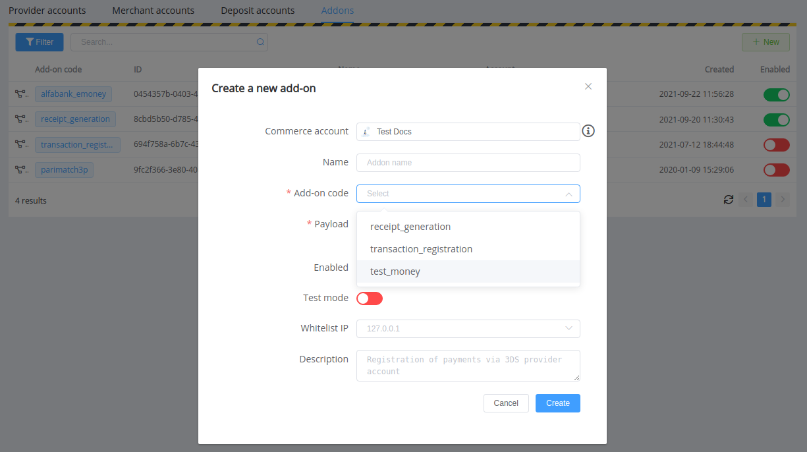
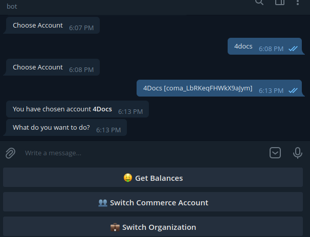

# September 9, 2021

<span style="font-size: 115%">[Corefy](https://corefy.com/) versions:<br>
**1.103**, **1.102**, **1.101**, **1.100**, **1.99**, **1.98**, **1.97**, **1.96**, **1.95**, & **1.94**</span>
<hr>
<div style="text-align: right; font-size: 85%; font-style: italic;">by Dmytro Dziubenko, Chief Technology Officer</div>

Cheery Greetings from the [Corefy](https://corefy.com/) team!

We almost haven't seen ourselves step over the 100th minor release, but it's just because we're keen on attaching new features to our products.

This month has the highest number of new and updated connectors: there are 130 for today. Check the [New connection](https://dashboard.paycore.io/connect-directory/payment-providers) page; maybe there's also one that you need so far?

## Highlights

* [Commerce updates](#commerce-updates): made invoice reference ID optional so now generate UUID randomly; added the `active-payment` object to payment invoice reconciliation
* Updated [addon creating](#addon-updates)
* [New Analytics tables and columns](#new-analytics-tables)
* Updated [Telegram bot](#telegram-bot) functionality
* And other performance improvements

## List of changes

### Commerce updates

#### Optional invoice reference ID

Did you have trouble coming up with a unique Reference ID while a new invoice creating? If so, forget about it. The creating form randomly generates a universally unique identifier (UUID) for you, and the system'll send that one ID if you don't want to replace it with yours. And we've also made this field optional.



#### Active payment's info for reconciliation

We've added the `active-payment` object that includes the payment ID to make the payment invoice reconciliation even more informative.

Endpoints: `/payment-invoices/{{id}}`

Method: GET

???+ example "Code sample"

    ```json hl_lines="61-64"
            {
                "data": {
                    "type": "payment-invoices",
                    "id": "cpi_e1btRXcSXe5L7grl",
                    "attributes": {
                        "serial_number": "e1btRXcSXe5L7grl",
                        "status": "processed",
                        "resolution": "ok",
                        "moderation_required": false,
                        "amount": 100,
                        "payment_amount": 100,
                        "currency": "UAH",
                        "service_currency": "UAH",
                        "reference_id": "6ce4568c-6b3c-4fc2-800f-4d4151409802",
                        "test_mode": true,
                        "fee": 0,
                        "deposit": 100,
                        "processed": 1632400303,
                        "processed_amount": 100,
                        "refunded_amount": null,
                        "processed_fee": 0,
                        "processed_deposit": 100,
                        "metadata": { ... },
                        "flow_data": {
                            "action": "https://cardgate.test.com/hpp/cgi_kO7NCLKfc32dzLED",
                            "method": "GET",
                            "params": [],
                            "metadata": { ... }
                        },
                        "flow": "hpp",
                        "payment_flow": "charge",
                        "created": 1632399882,
                        "updated": 1632400303,
                        "payload": { ... },
                        "description": "Invoice Example",
                        "descriptor": null,
                        "callback_url": "https://webhook.site/072677a8-eebb-4fd5-82eb-609d9b30a0dc",
                        "return_url": "https://example.com",
                        "return_urls": { ... },
                        "original_data": { ... },
                        "rrn": null,
                        "approval_code": null,
                        "reserved_amount": null,
                        "reserve_expires": null,
                        "unreserved": null,
                        "source": "merchant_api",
                        "callback_logs": [],
                        "charged_back_amount": null,
                        "resolution_message": null
                    },
                    "relationships": {
                        "payment-service": {
                            "data": { ... }
                        },
                        "payment-method": {
                            "data": { ... }
                        },
                        "customer": {
                            "data": { ... }
                        },
                        "active-payment": {
                            "data": {
                                "type": "payments",
                                "id": "pay_1FJlsHzoBgvjThdeuLTc0bpU"
                            }
                        }
                    },
                    "links": {
                        "self": "/api/payment-invoices/cpi_e1btRXcSXe5L7grl"
                    }
                }
            }
    ```

### Addon updates

We've [further updated](/release-notes/v1.83-1.93/#addons-update) the form for a new addon connecting by increasing its functionality.



### New Analytics tables

From now on, you can add to queries extra tables for batch payouts.

!!! example "Tables and columns for use"

    === "`com_payout_batches`"

        * `id`
        * `commerce_account_id`
        * `currency_account_id`
        * `currency`
        * `status`
        * `resolution`
        * `options`
        * `reference_id`
        * `name`
        * `description`
        * `total_items`
        * `total_item_status`
        * `total_processed_amount`
        * `total_processed_fee`
        * `total_processed_writeoff`
        * `processed`
        * `created`
        * `test_mode`
        * `total_estimated_amount`
        * `total_estimated_writeoff`
        * `total_estimated_fee`

    === "`com_payout_batch_items`"

        * `id`
        * `payout_batch_id`
        * `payout_invoice_id`
        * `status`
        * `resolution`
        * `service_code`
        * `service_method`
        * `service_currency`
        * `service_amount`
        * `reference_id`
        * `fields`l and generate UUID randomly;
        * `description`
        * `processed`
        * `created`
        * `commerce_account_id`
        * `resolution_message`
        * `customer`

We're also added the column `processed_route_id` for the `pg_payments` table.

### Telegram bot

And here come good news for Telegram and, specifically, our Telegram bot users. Now you can choose the account you want to get info about by turning pages in the general list and finding it by the ID or reference ID.



### Performance improvements

We put a lot of attention on our platform's improvements, and, is as often the case, we found some bugs and needed fixes to do (yes, all these imperfections annoy us too).

Stay tuned for the next updates!
